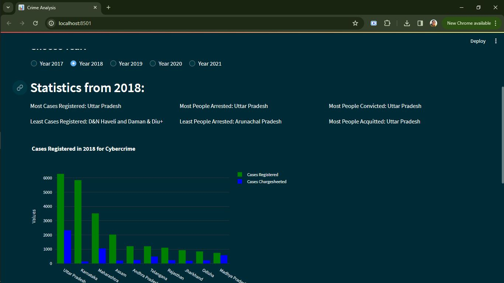

# CyberEye: Unveiling Cyber Crime Trends
--> Utilized data analysis techniques to create insightful visualizations from 2017-2021 Cybercrime data sourced from National Crime Records Bureau(NCRB), highlighting trends in acquittal rates, arrests, cases registered, etc.

## Screenshots

---
## Project Structure
- **'data/'** : CSV files that store cybercrime data, collected from NCRB, from 2017 to 2021
- **'Scraper'** : Google Colab file that contains the code for the web scraper. [link](https://colab.research.google.com/drive/1SBmBehg6YMJuS-XGfIz9FBo6Gpk_zB3O?authuser=4#scrollTo=SEBuN6SHxJJ8)
- **'images'** : screenshots of the web app
- **'app.py'** : streamlit web application; the main page.
- **'state.py', 'variables.py', 'years.py'** : helper code to the *app.py* web app.

## Steps
- Scraping data from [NCRB website](https://www.pib.gov.in/PressReleseDetailm.aspx?PRID=1883066).
- Data cleaning and preprocessing
- Creation of insightful visualizations to highlight trends of acquittal rates, arrests, cases registered, etc.
- Development of an interactive web interface using Streamlit.

## Technologies used
- **Python** : The programming language used for end-to-end tasks; from scraping to making of the web app.
- **BeautifulSoup** : used for *Web Scraping*, and gathering data from the [NCRB website](https://www.pib.gov.in/PressReleseDetailm.aspx?PRID=1883066)
- **Pandas** : used for *Data Analysis*, i.e. to clean & organize data, and to find various trends.
- **Streamlit** : used to create interactive *Web App*, and to display trends & visualizations
